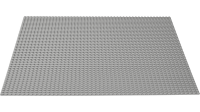

# 100 - Introduction

## Goal

We aim to compare Azure 'building blocks' with LEGO building bricks, to simplify the understanding of how Azure is 'constructed'.

For example:

### Azure Virtual Network:

*"Azure Virtual Network is the fundamental building block for your private network in Azure. A virtual network is a virtual, isolated portion of Azure public network. Use VNets for communication between Azure resources, the internet, and on-premises networks."*

Source: https://microsoftlearning.github.io/AZ-305-DesigningMicrosoftAzureInfrastructureSolutions/

### LEGO Baseplate:

*"A Baseplate is a large flat plate in many colors, on which structures are often built ontop of. They can be bought as sets like 628 X-Large Grey Baseplate or come in sets that contain buildings. Compared to regular plate elements, baseplates are thinner and flat and their undersides cannot be connected to other studded pieces."*

Source: https://brickipedia.fandom.com/wiki/Baseplate

## Proof of Concept: Create a serverless app on Azure for beginners
Using a custom domain, TLS encryption, and Terraform for infrastructure as code.

## Why?
The idea of running our own web servers, sizing VMs and patching OSes seems so 2005. For simple web apps, and seeing if our new service will stick, we want hosting that is as low-cost as possible, but we also want the ability to scale elastically for when we get picked up on Hacker News.

We also want to try some of the new [Azure Terraform resources](https://www.terraform.io/docs/providers/azurerm/) and take [Azure Container Instances](https://azure.microsoft.com/en-us/services/container-instances/) for a spin. I’ll show you how to run an API with a long-running Docker container (~ $2/day), as well as using an Azure Function for ultimate low-cost (pay per-request).

## How?
In this example, we’ll use Azure for our storage and compute, layering [CloudFlare](https://www.cloudflare.com/) on top for TLS encryption to the client. We’ll manage this whole multi-provider stack with one terraform configuration, practicing what we preach with Infrastructure as Code.

The code can be found here if you want to reproduce: github.com/dcolebatch/azure_serverless_example

So let’s unpack this!
