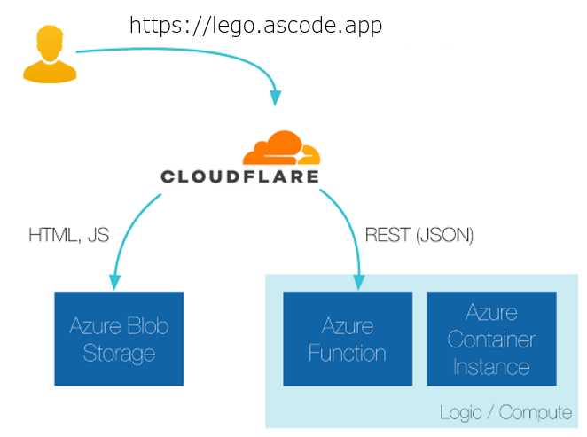

# 300 - Building Our Application

## 100 - Starting From The Bottom
Our simple web application is comprised of some static HTML and JavaScript. The JavaScript makes an asynchronous call to a small web service which serves up a random URL to a cat image and this is included in the page.



Simple architectures are the easiest to manage :)

This pattern works just as well with a more complex frontend application. For single page applications (SPAs), we can write it with React or Angular and setup our deploy pipelines to upload the assets to the blob store. A cheap and cheerful way to accomplish this is: 
[GitLab CI](https://about.gitlab.com/features/gitlab-ci-cd/) — to → Azure

Our web service is the highly sought after [random-cats service](https://github.com/ascode/lego-as-code/blob/main/api), [pre-built on dockerhub for your convenience](https://hub.docker.com/r/dcolebatch/random-cats/). We can deploy this by using a few lines of Terraform:

```
resource "azurerm_container_group" "aci-api" {
  name                = "aci-api"
  location            = "${azurerm_resource_group.serverless.location}"
  resource_group_name = "${azurerm_resource_group.serverless.name}"
  ip_address_type     = "public"
  os_type             = "linux"

  container {
    name   = "meow"
    image  = "dcolebatch/random-cats"
    cpu    ="0.5"
    memory =  "0.5"
    port   = "80"

    environment_variables {
      "NODE_ENV" = "production"
    }

    volume {
      name       = "logs"
      mount_path = "/aci/logs"
      read_only  = false
      share_name = "${azurerm_storage_share.aci-share.name}"

      storage_account_name  = "${azurerm_storage_account.aci-sa.name}"
      storage_account_key   = "${azurerm_storage_account.aci-sa.primary_access_key}"
    }
  }

  tags {
    environment = "LEGO-as-Code"
  }
}
```

setup/main.tf
